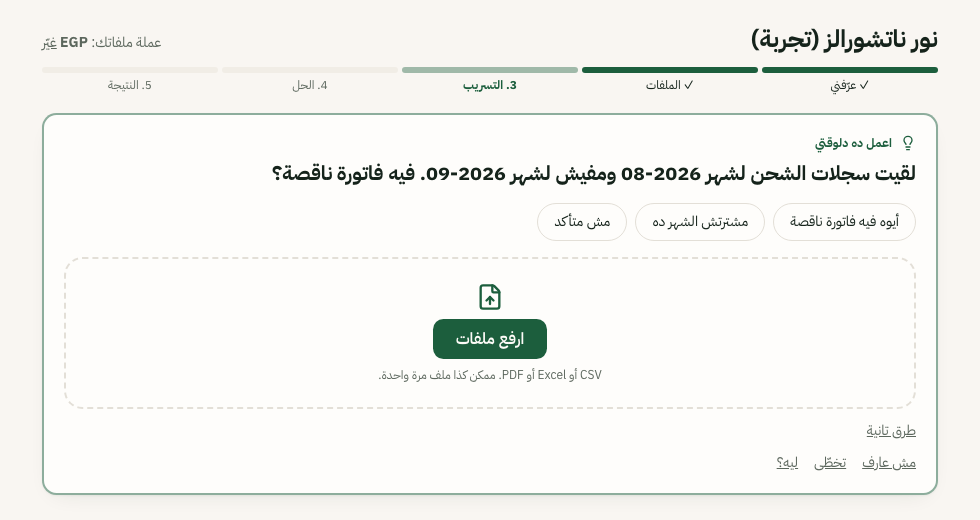
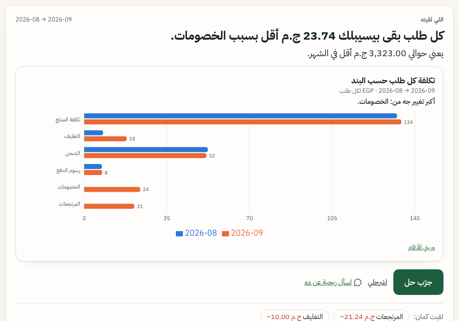
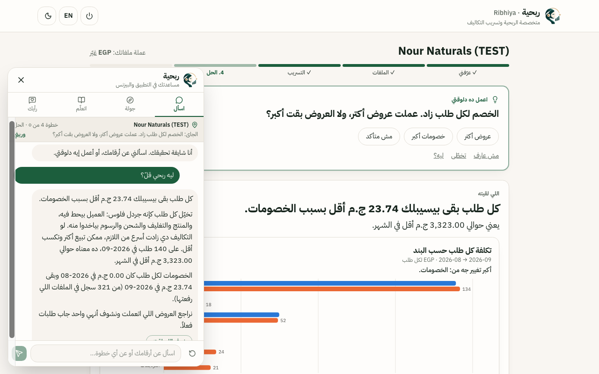
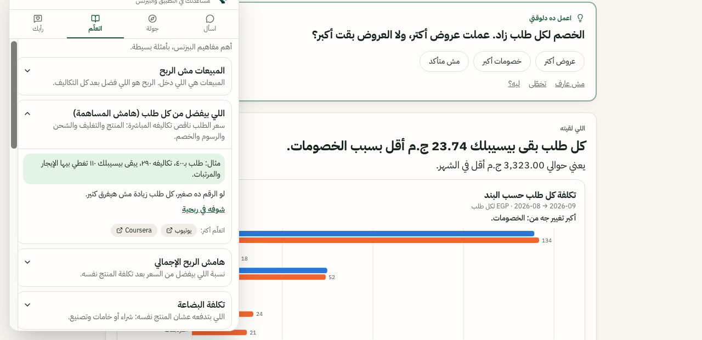
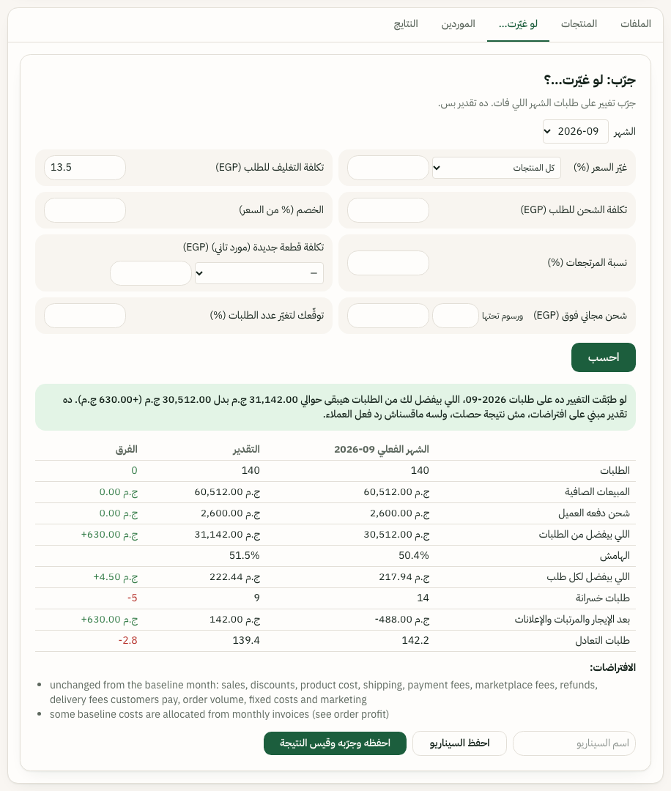

<div align="center">


# ربحية · Ribhiya

**مستشارة ربحية بالذكاء الاصطناعي، بتتكلم مصري، لأصحاب المشاريع الصغيرة**
**An Arabic-first AI profitability advisor for small product businesses**

*Finds the leak · **test any decision before you spend a pound** · teaches you the business*

*Built with [Hermes Agent](https://github.com/NousResearch/hermes-agent) · every number calculated, never invented · 145 tests*

</div>

---

## The problem / المشكلة

> **«ببيع أكتر من الأول… بس الفلوس اللي بتفضل معايا أقل. ومش عارف بتروح فين.»**
> *"I'm selling more than before, but I keep less money, and I don't know where it goes."*

That sentence describes a huge number of small online shops, Instagram sellers and young brands in Egypt. Their
profit doesn't disappear in one big mistake. It **leaks** a few pounds per order: packaging got pricier, the courier
raised rates, a promotion ran too long, returns went up. The evidence is scattered across a sales export, supplier
invoices, a courier statement and a spreadsheet, and the owner usually:

- has **no accountant** and no finance background (most are first-time founders),
- finds existing tools built for accountants, in English, full of jargon, assuming you already know what to look for,
- gets dashboards full of charts that **show numbers but don't say what they mean or what to do next**.

**Ribhiya reads the files the owner already has, finds exactly where the profit is leaking, and walks them through
fixing it, step by step, in the way an Egyptian shop owner actually talks.**

## Why Egyptian Arabic? / ليه بالمصري؟

Because understanding is the product. A beginner won't act on "your contribution margin declined due to variable
cost inflation". They will act on:

> **«كل طلب بقى بيسيبلك 23.74 ج.م أقل بسبب الخصومات. يعني حوالي 3,323 ج.م أقل في الشهر.»**
> *"Each order now leaves you EGP 23.74 less because of discounts. That's about EGP 3,323 less per month."*

Everything (questions, findings, charts, the assistant, supplier emails) is written in natural Egyptian Arabic
(العامية المصرية), with English one click away (**EN / ع**) and full right-to-left layout. Simple words first;
the technical term only in brackets, explained.

## The "aha" moment, in 4 screenshots

**1. It asks instead of guessing.** Upload the first files and Ribhiya notices September has no shipping invoice.
Most tools would happily report "shipping costs dropped to zero, great job!". Ribhiya stops and asks:



**2. It finds the leak, per order, in one sentence.** One finding, one chart, one button to fix it:



**3. It explains your numbers like a patient advisor.** Ask *«ليه ربحي قلّ؟»* (why is my profit down?) and it answers
from **your** investigation, with an analogy a beginner gets, and says where the answer came from:



**4. It teaches you the business, not just the answer.** Every concept comes with a simple example, why it matters,
where to see it in your own data, and where to learn more:



## The biggest feature: «لو غيّرت…؟» (What if…?), test a decision before you spend

Small business owners make expensive decisions on gut feeling: *"Should I raise prices 5%?"*, *"Is free shipping
above 500 worth it?"*, *"Should I switch to the cheaper box supplier?"*. A wrong guess costs real money.

**Ribhiya lets the owner try the decision on their own real month first.** Pick a month, change one or more
levers, press **احسب (Calculate)**, and see what would have happened, order by order:



In this example, cutting packaging from 18.00 to **13.50 per order** in September would mean:

| | Actual Sep | Projection | Change |
|---|---|---|---|
| What each order leaves | 217.94 | 222.44 | **+4.50 per order** |
| What all orders leave | 30,512 | 31,142 | **+630 a month** |
| Orders that lose money | 14 | 9 | **−5** |
| After rent, salaries and ads | **−488 (a loss)** | **+142 (a profit)** | the month turns profitable |
| Orders needed to break even | 142.2 | 139.4 | −2.8 |

**What you can test (8 levers, combinable):**
- **Price** change, for all products or one product
- **Packaging** cost per order, **shipping** cost per order
- **Discount** level, **return rate**
- **A new supplier's unit cost** for a product (straight from a real quote: **Test in simulator** on any compared
  quote)
- **Free shipping above** a basket value, with a fee below it (uses what customers actually paid for delivery)
- **Your own guess** for how orders would change (e.g. "price +5%, orders −10%")

**Why owners can trust it:**
- It recalculates **every order** of the real month with the same engine as the analysis, not a rough average.
  Your files are never modified.
- Every result is labelled **a projection, not a saving**, and lists its assumptions (what stays the same).
  Raising prices, for example, states that it assumes customers keep buying the same amounts, unless you enter
  your own guess.
- If the data can't support a lever (e.g. no per-order delivery fees for free shipping), the lever is switched off
  with the reason, instead of guessing.

**And then it closes the loop:** save the scenario as an **experiment** (**احفظه وجرّبه وقيس النتيجة**), make the
change in real life, upload next month's files, and Ribhiya checks what actually happened. In the test pack,
packaging went from 18.00 to 13.50 per order after switching supplier (−25%), reported as "observed after the
change", never as proof it was the cause. Verified results go into Ribhiya's memory, so future advice builds on
what really worked for this business.

## It doesn't just do the job for you. It teaches you.

Most tools hand a beginner a report. Ribhiya's goal is that the owner **understands their own business** after
using it:

- **One step at a time.** A five-step journey (عرّفني → الملفات → التسريب → الحل → النتيجة) and a single
  **«اعمل ده دلوقتي» (Do this now)** card. Every request says *why* it matters and what to do if you don't have it.
- **A built-in business course.** The **اتعلّم (Learn)** tab explains 13 core concepts in plain Egyptian Arabic:
  sales vs profit, what each order leaves (contribution margin), gross margin, cost of goods, fixed vs variable
  costs, break-even, pricing, discounts, returns, cash flow vs profit, stock and minimum order quantity, average
  order value and customer cost, and test-and-measure. Each has a worked example and **YouTube and Coursera links**
  to learn more (search links, so they never point to a dead or made-up video).
- **A guided tour** of every feature with **وريني (Show me)**, which jumps to the exact card or tab.
- **It explains the "why".** Every finding has **اشرحلي (Explain)**: the reason, the evidence from your files, the
  caveats, and quality-aware options, so the owner learns to read their own numbers.
- **It teaches good habits.** Never compare a full month with an empty one; get 2–3 written quotes for the *same*
  specification; count the extra units a minimum order forces you to buy; test a change before making it; then
  measure it, and remember that "it improved after I changed it" isn't proof it was the cause.

## It remembers your business and gets better with use

Ribhiya has **governed memory** (`revenue_agent/profit/memory.py`):

- **It learns your files.** Confirm once what your columns mean (e.g. an export with *Ref, When, Item, Count,
  Each*) and every future file with that layout is read automatically, with the note "used the column mapping you
  confirmed before".
- **It learns what worked for you.** When a change is verified with new data (e.g. packaging per order went from
  18.00 to 13.50 after switching supplier), that outcome is remembered and given to the Hermes advisor as context
  for future advice.
- **It never asks twice.** Say «معنديش الملف ده» (I don't have this file) and it continues without it, for good.
- **It learns only from you, safely.** Memory is written only from things the owner confirmed or results verified
  with real data, never from AI output or text inside uploaded files. Entries that keep getting corrected retire
  themselves, and the owner can see everything Ribhiya remembers and **forget** any of it.

## Built with Hermes Agent

Questions about your numbers are answered by **[Hermes Agent](https://github.com/NousResearch/hermes-agent)**
(Nous Research), running in a locked-down profile created by `revenue-agent hermes-setup-profit`:

- a **Ribhiya skill** (`skills/tahseela-profit/SKILL.md`) that teaches Hermes how to explain profit to a beginner,
  in Egyptian Arabic, from evidence only;
- **read-only MCP tools** (`profit_*` in `revenue_agent/mcp_server.py`) pinned to one business, so Hermes reads the
  computed investigation, the owner-confirmed memory and verified outcomes, and can't change anything;
- every built-in Hermes toolset (terminal, files, web, code) disabled except skills;
- its answer checked before the owner sees it: secrets removed, and any figure not in the calculations flagged.

No Hermes installed? Ribhiya falls back to Google Gemini (free tier), then to rule-based answers from the same
calculations, and always says which one answered.

## Every number is calculated, never invented

The AI only puts numbers into words. Every figure comes from deterministic Python code, traceable to the file and
row it came from:

- **145 automated tests**, including hand-calculated expected values, "the causes add up exactly to the change",
  "a projection never becomes a result", and AI-output checks with a fake provider.
- **A fictional test pack** (`test-data/tahseela-test-pack/`) whose expected results are written down in advance in
  [docs/TEST_GUIDE.md](docs/TEST_GUIDE.md): −23.74 discounts per order, 14 of 260 orders losing money, a what-if
  of +630.00. Run it and compare.
- Missing data is shown as missing, never as zero. A projection is always labelled a projection. Nothing is sent to
  a supplier without the owner approving the exact text.

## Try it in 5 minutes

```bash
git clone https://github.com/martinaarmanios21-dot/ribhiya.git && cd ribhiya
uv sync
uv run revenue-agent serve          # → http://127.0.0.1:8000
```

No API key needed. Start an investigation, upload the numbered files from `test-data/tahseela-test-pack/` in order,
and follow [docs/TEST_GUIDE.md](docs/TEST_GUIDE.md). Run the tests with `uv run pytest -q`.

> Honest scope: everything shown here runs on fictional test data. No real business has used Ribhiya yet, so no
> real-world savings are claimed. Email to suppliers is tested with a fake mail server only.

More: [docs/PROFIT_INVESTIGATION.md](docs/PROFIT_INVESTIGATION.md) (workflow, Hermes integration, memory) ·
[docs/SECURITY.md](docs/SECURITY.md) · [docs/HACKATHON_READINESS.md](docs/HACKATHON_READINESS.md)

---

## Chat with Ribhiya (in-app guide)

The button at the bottom corner of every page opens a small panel with four tabs. Inside an investigation it knows
where you are: it shows the step and the next action (the same as **Do this now**), and answers from that
investigation ("Why is my profit down?" → the profit advisor; "What should I do now?" / "What's missing?" / "What can
I do about it?" → its computed state). On Home it helps you get started.
- **Ask:** your numbers (inside an investigation), using the app, or business concepts. Answers come from hand-written help content
  (`revenue_agent/guide/content.py`) and are instant. Only an unmatched question goes to the AI (if a key is set),
  and it gets the question and the help text, never your files or figures.
- **Tour:** each feature in short steps, with **Show me**, which opens the right page, tab or card.
- **Learn:** key business concepts (margin, break-even, cash flow, pricing…) with a simple example and YouTube /
  Coursera **search** links (no hand-picked videos).
- **Feedback:** a review with stars, a feature idea or a problem. It's stored in your local database
  (`guide_feedback` table, export at `/api/guide/feedback.csv`) and not sent anywhere.

## Run it

Requirements: Python 3.11+ and [uv](https://docs.astral.sh/uv/getting-started/installation/).

```bash
git clone https://github.com/martinaarmanios21-dot/ribhiya.git && cd ribhiya
uv sync
uv run revenue-agent serve          # → http://127.0.0.1:8000   (port busy? add --port 8080)
```

1. On Home, type your business name and click **Start a new investigation**.
2. **Do this now** asks a few short questions, then for your sales file. Upload it plus product costs and
   supplier/expense invoices (CSV, Excel or text PDF). It asks for anything else it needs, and says why.
3. **What I found** shows the biggest cost leak per order, with a chart and **Explain**. **Get cheaper prices**
   prepares a supplier quote request you approve.
4. The tabs hold the rest: **Files · Products · What if · Suppliers · Results**. Ask questions in **Chat with Ribhiya**
   (bottom corner); inside an investigation it answers from that investigation. A fictional test pack with a step-by-step guide: `uv run python scripts/make_test_pack.py`.

Optional configuration (`.env`, see `.env.example`): an LLM key (`GEMINI_API_KEY`, free from Google AI Studio),
SMTP for sending approved supplier requests (`EMAIL_SENDING_ENABLED=1`, `SMTP_*`), `ADMIN_TOKEN` for any shared
deployment.

Tests: `uv run pytest -q` (145 tests: profit investigation, in-app guide, evidence and supplier outreach, order profit, simulator, quotes, security, plus the simulation lab). Frontend: `cd frontend && npx vitest run`. MCP server with the read-only profit tools: `uv run python -m revenue_agent.mcp_server`.

> **Collections was removed (2026-10-10).** The former invoice-collections workflow (invoice import, overdue
> analysis, follow-up emails, its chat agent, pages and API) is gone. The shared pieces it had (value parsing,
> audit log, SMTP mailer) live on in `revenue_agent/ledger/` and are used by the profit investigation. Its database
> tables are left untouched, so no stored records were deleted.

## Simulation lab (synthetic data, for testing learning and guardrails)

Separate from the product and not linked from the app (it is the original collections-agent research harness):
fictional customers with hidden personas let the self-improvement loop and guardrails be stress-tested reproducibly. **البيانات دي للاختبار فقط، ومش بتمثل معاملات حقيقية.** Its numbers never appear
in the main app.

```bash
uv run revenue-agent --engine offline demo --yes     # train → reflect → eval gate → guardrail checks
# reviewer dashboard for the lab: http://127.0.0.1:8000/judges
```

An audit found the earlier headline ("84% cash collected") was inflated: agreed instalment plans were counted as
cash, and the learner was rewarded for escalating or using a firm tone on first contact. With those fixed (cash =
PAID only, plans reported separately, a deterministic first-contact constraint), the learned candidates are safer
(0 complaints, 9/9 safety cases) but collect **less** cash (14.4% vs 23.8%) because they offer plans to everyone,
so **the eval gate rejects them** and the active skill stays unchanged. See
[docs/EVALUATION_METHODOLOGY.md](docs/EVALUATION_METHODOLOGY.md#5-simulation-lab-what-changed-and-the-honest-result).

**Optional Hermes brain:** with [Hermes Agent](https://github.com/NousResearch/hermes-agent) installed:

```bash
uv run revenue-agent hermes-setup            # creates an isolated Hermes profile "tahseel" pinned to free Gemini,
                                             # installs the skill, registers the MCP server
hermes -p tahseel mcp test revenue_agent     # should list 6 tools
uv run revenue-agent --engine hermes demo
```

The Hermes engine **refuses to run unless `HERMES_MODEL` is set**, and it uses its own profile with an explicit
provider. It can never fall back to a paid model from your default Hermes profile.

## How it works

```
             ┌────────────────────── brains (decide only, never act) ───────────────────────┐
             │  offline: playbook executor   api: free LLM (Gemini→OpenRouter→NVIDIA)        │
             │  hermes: Hermes Agent + ar-collections skill, talking ONLY via MCP tools      │
             └──────────────────────────────┬────────────────────────────────────────────────┘
                                            │ decisions (JSON)
     ┌──────────────────────────────────────▼─────────────────────────────────────────────┐
     │ GUARDRAILS (deterministic, agent cannot modify): schema validation · permissions    │
     │ · exact-amount/ID checks · no legal threats/discounts/foreign links/other customers │
     │ · ledger re-check · disputes & opt-outs · rate limits · max touches · human approval│
     └──────────────────────────────────────┬─────────────────────────────────────────────┘
                                            │ allowed actions
     ┌──────────────────────────────────────▼─────────────────────────────────────────────┐
     │ ENGINE: state machine (optimistic versioning) · leases · run lock · outbox with     │
     │ idempotency keys · kill switch · budgets · trace IDs                               │
     └──────────────────────────────────────┬─────────────────────────────────────────────┘
                                            │ executes against
                       Debtor simulator (hidden personas)  ·  in production: email + accounting APIs
                                            │ outcomes (paid? complained? disputed?)
     ┌──────────────────────────────────────▼─────────────────────────────────────────────┐
     │ LEARNING: evidence report → brain proposes new SKILL.md → static checks (HARD-RULES │
     │ immutable) → eval gate (holdout + golden cases) → HUMAN promotes → versioned/rollback│
     └────────────────────────────────────────────────────────────────────────────────────┘
```

Read more:
- [docs/AGENT_SPEC.md](docs/AGENT_SPEC.md): goal, decisions, tools, state, validation, failure modes, human role, recovery, stop conditions
- [docs/FAILURE_MODES.md](docs/FAILURE_MODES.md): the 12 reliability factors and where each is enforced in code
- [docs/SELF_IMPROVEMENT.md](docs/SELF_IMPROVEMENT.md): how the agent learns without being allowed to break itself
- [docs/ARCHITECTURE.md](docs/ARCHITECTURE.md) · [docs/EVALS.md](docs/EVALS.md) · [docs/SECURITY.md](docs/SECURITY.md) · [docs/BUSINESS_CASE.md](docs/BUSINESS_CASE.md)

## Honest limitations

- No real outcome history ships with the project, so no measured saving on real data is claimed.
- Email sending uses SMTP and is covered by tests with a fake SMTP server; it has not been verified against a
  real provider in this repository. Without SMTP configured, Ribhiya only drafts and copies.
- Files are uploaded by hand (CSV, Excel, text PDF); there is no live accounting or store connector, and no OCR for
  scanned PDFs.
- Single-user app; set `ADMIN_TOKEN` before exposing it. The MCP HTTP transport has no built-in auth.
- The Wesam package in docs/WESAM_PACKAGE.md describes the removed collections agent and is out of date.

## Front end

`frontend/` is the React app. The built files are committed in `revenue_agent/web/app/`, so reviewers don't need
Node. Rebuild with `bash scripts/build_frontend.sh`. It talks only to the real API: there is no demo-data
fallback. The earlier role-based screens (simulator-only) remain in `frontend/src/routes/` but are excluded from
routing in `vite.config.ts`.

MIT licensed.
